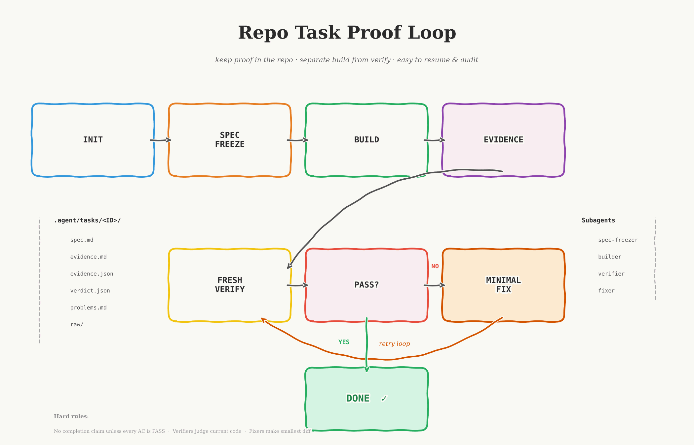

# Repo Task Proof Loop

Codex-focused fork of [DenisSergeevitch/repo-task-proof-loop](https://github.com/DenisSergeevitch/repo-task-proof-loop).

This fork keeps the upstream proof-loop structure and Apache-2.0 license, but changes the package for Codex-first usage:

- default `init` is Codex-only
- Windows path handling is fixed for task guidance seeding
- the Codex side gets an explicit helper ladder:
  - `task-scout`
  - `task-explorer`
  - `task-worker-lite`
  - `task-worker-strong`
- `task-builder` stays inheritance-first as the strong integration owner

If you publish this repository to GitHub, users can install it via the Codex skill installer by pointing it at the published repo or its root `SKILL.md`.

This skill was built from [OpenClaw-RL: Train Any Agent Simply by Talking](https://arxiv.org/html/2603.10165v1) and applies its proven approach to agentic flows in a repo-local workflow.

> "next-state signals are universal, and policy can learn from all of them simultaneously."

Repo Task Proof Loop is a repo-local workflow skill for non-trivial coding tasks.

It creates a durable task folder under `.agent/tasks/<TASK_ID>/`, installs project-scoped subagents for the active tool profile, updates repo guidance, and drives a strict loop:

`spec freeze -> build -> evidence -> fresh verify -> minimal fix -> fresh verify`

For Codex, that loop also supports an adaptive bounded fan-out path for the installed task-specific helper roles, with built-in `explorer` / `worker` kept only as fallback when those roles are unavailable in the current product surface.

The point is simple: keep proof inside the repository, separate implementation from verification, and make task state easy to resume or audit later.



## What It Creates

Inside the target repository:

```text
.agent/tasks/<TASK_ID>/
  spec.md
  evidence.md
  evidence.json
  raw/
    build.txt
    test-unit.txt
    test-integration.txt
    lint.txt
    screenshot-1.png
  verdict.json
  problems.md

.codex/agents/
  task-spec-freezer.toml
  task-scout.toml
  task-explorer.toml
  task-builder.toml
  task-worker-lite.toml
  task-worker-strong.toml
  task-verifier.toml
  task-fixer.toml

```

When Claude support is explicitly requested, it can also install:

```text
.claude/agents/
  task-spec-freezer.md
  task-builder.md
  task-verifier.md
  task-fixer.md
```

It also inserts managed workflow blocks into the repo guide files that match the selected profile:

- the repo-root `AGENTS.md` Codex baseline
- the repo's Claude guide file: `CLAUDE.md` or `.claude/CLAUDE.md`

## Install

## Fork Provenance

Upstream repository:
- [DenisSergeevitch/repo-task-proof-loop](https://github.com/DenisSergeevitch/repo-task-proof-loop)

This repository is a modified fork for Codex-oriented workflows and token-aware helper routing. See [FORK.md](FORK.md) and [NOTICE](NOTICE) for the modification summary.

Install the skill as a project skill.

### Codex

```text
.agents/skills/repo-task-proof-loop/
```

### Claude Code

```text
.claude/skills/repo-task-proof-loop/
```

If you use both tools on the same repository, install it in both locations or keep one canonical copy and sync it.

## Quick Prompts

Use this prompt for the normal flow:

### Do Task

```text
Use $repo-task-proof-loop to do the task described below in this repository. Reuse the matching repo-local task if it already exists; if not, initialize it first and then continue automatically after init completes. You are explicitly authorized to use subagents and bounded parallel helper work when it materially helps.
...
```

For all prompts, replace `...` with `Task ID: <task-id>` and either `Task file: <path/to/task-file.md>` on the next line or the task text pasted on following lines.

This short prompt is the canonical entrypoint. Do not push routing policy into the user prompt; keep orchestration inside the skill.

This skill is intentionally proof-first, so `init` always comes before build.
Keep `task-builder` inheritance-first so the parent session controls implementation depth. Use the installed helper roles to save tokens on bounded work:

- `task-scout` for cheap read-only lookup and path mapping
- `task-explorer` for deeper read-only tracing and contract analysis
- `task-worker-lite` for one-file or tightly bounded low-risk edits
- `task-worker-strong` for bounded multi-file or ambiguity-prone edits

The parent/orchestrator stays strong; the helper layer does the cheaper bounded work. Built-in `explorer` / `worker` are fallback only when the task-specific roles are unavailable in the current product surface.

For users, the intended interaction stays simple: run Codex, mention `$repo-task-proof-loop`, and describe the task.

## Quick Start

1. Install the skill in the repository.
2. For the normal flow, use the [Do Task prompt](#do-task) or mention Repo Task Proof Loop (`$repo-task-proof-loop`) and describe the task.
3. That's it.

## Helper Script

The bundled helper script currently ships three CLI commands:

- `init` - create the repo-local task folder, artifacts, guides, and subagents
- `validate`
- `status` - inspect an existing initialized task

The workflow phases `freeze`, `build`, `evidence`, `verify`, `fix`, and `run` are skill-level commands for the agent, not direct CLI subcommands in this package.

Set `SKILL_PATH` to the installed skill directory:

### Codex example

```bash
SKILL_PATH=.agents/skills/repo-task-proof-loop
```

### Claude Code example

```bash
SKILL_PATH=.claude/skills/repo-task-proof-loop
```

Initialize a task:

```bash
python3 "$SKILL_PATH/scripts/task_loop.py" init \
  --task-id feature-auth-hardening \
  --task-file docs/tasks/auth-hardening.md
```

Or seed from inline text:

```bash
python3 "$SKILL_PATH/scripts/task_loop.py" init \
  --task-id feature-auth-hardening \
  --task-text "Implement auth hardening for session refresh and logout."
```

Validate:

```bash
python3 "$SKILL_PATH/scripts/task_loop.py" validate \
  --task-id feature-auth-hardening
```

Run `validate` only after `init` completes. If it reports initialization in progress, wait and rerun.

Status:

```bash
python3 "$SKILL_PATH/scripts/task_loop.py" status \
  --task-id feature-auth-hardening
```

Use `status` after `init` completes when you want stable task state. If it returns `init_in_progress: true`, retry after `init` finishes.
Do not run `validate` or `status` in parallel with `init`.

Useful options:

- `--guides auto|agents|claude|both|none`
- `--install-subagents both|codex|claude|none`
- `--force`

In this installed copy, the default initializer profile is Codex-only. For an explicit Codex-only run, use:

```bash
python3 "$SKILL_PATH/scripts/task_loop.py" init \
  --task-id feature-auth-hardening \
  --install-subagents codex \
  --guides agents
```

With `--guides auto`, the initializer preserves existing guide files, but it also ensures `CLAUDE.md` exists whenever Claude agents are being installed and `AGENTS.md` exists whenever Codex agents are being installed.

## Validation

The package includes a smoke test:

```bash
python3 "$SKILL_PATH/scripts/verify_package.py"
```

It checks the skill structure, initializes temporary repositories, installs the task artifacts and subagents, and verifies the generated task bundles and guide behavior.

## Helper routing

This installed copy uses a deliberate cost ladder aligned with the current OpenAI model docs:

- `task-builder` inherits the parent session. Run the parent strong when the task is large or ambiguous.
- `task-scout` uses `gpt-5.4-mini` at `low` for cheap read-only ownership and lookup work.
- `task-explorer` uses `gpt-5.4-mini` at `high` for deeper read-only tracing where the task is still bounded but requires more reasoning.
- `task-worker-lite` uses `gpt-5.4-mini` at `medium` for narrow edits with explicit ownership.
- `task-worker-strong` uses `gpt-5.4` at `high` for bounded but riskier implementation work.
- `task-verifier` stays on `gpt-5.4` as the judge role.

That keeps the strongest reasoning on orchestration, integration, and judgment while offloading narrow work to cheaper helpers.

## More Detail

The exact role prompts and platform-specific guidance live in:

- `references/COMMANDS.md`
- `references/SUBAGENTS.md`
- `references/REFERENCE.md`
- `SKILL.md`
